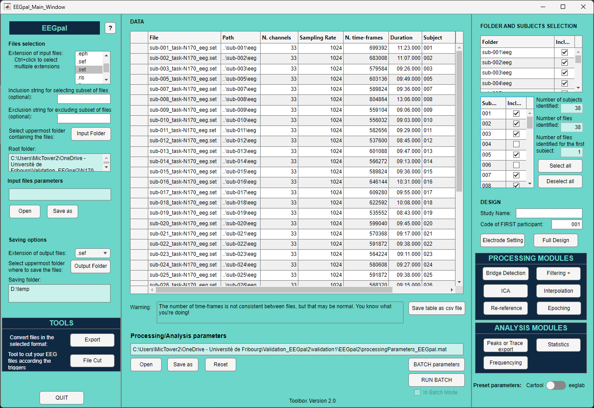

# EEGpal
EEGpal is an open-source Matlab-based software for automated/semi-automated EEG data pre-processing and analyses.
It proposes Graphical User Interfaces (GUIs) that allow EEG pre-processing to be batched across participants with a high degree of flexibility in processing parameters. 
It includes tools to :
- filter data
- detect channel bridges 
- performed independant component decomposition/recomposition ICA
- interpolate 
- re-referencing
- epoching
- frequency analysis
- Peaks or Trace Export
- Statistics on tracks
- cut EEG files
- Export to another format 

It manage many different of file format like *.bdf, .set/.fdt, .eph,.ep, .sef, .ris, .freq, .mrk, .eeg/vhdr *. 
The purpose is to offer a complement to the free software Cartool developed by Denis Brunet (University of Geneva, reference:
Brunet D., Murray M., Michel C. (2011) Spatiotemporal analysis of multichannel EEG: CARTOOL. Computational intelligence and neuroscience, vol. 2011, 813870. DOI : 10.1155/2011/813870).  
It is also an alternative to the original EEGLAB GUI (reference: 
Delorme, A., & Makeig, S. (2004). EEGLAB: an open-source toolbox for analysis of single-trial EEG dynamics. Journal of Neuroscience Methods, 134(1), 9-21. DOI: 10.1016/j.jneumeth.2003.10.009). 

## Minimum requirement
Matlab 2018b or later
Tested on Windows and Mac. Should work on Linux but not tested.

## How to install and run
1. Download the EEGpal repository on your local drive.
2. If you have an eeglab version already mapped in your Matlab path, remove it (because it could generate conflict with the eeglab version include inside of EEGpal).
3. Add this folder to your local Matlab path (use of the command *setpath('path of the EEGpal folder')*.
4. Use the command *EEGpal* to start the software.

## How to use it
*Throughout the Guided User Interfaces (GUIs) you will find additional information while pressing on the* `❓ buttons`.
Otherwise you will find written tutorial files in the folder */Manuels* of this repository.

## Cite the repository
De Pretto M., Mouthon M., EEGpal, (2024), GitHub repository, https://github.com/DePrettoM/EEGpal \

## Dependencies
| PLUGINS | Description |
| ------ | ------ |
| [EEGLAB v2023.1](https://github.com/sccn/eeglab) | Use in sveral places. Look at help to know more when it is used. |
| [Signal processing toolbox]() | Use of the function filtfilt for filtering EEG data. | 
| [Statistics and Machine Learning Toolbox ]() | Use by the Statistics module. | 

| EEGLAB EXTENSIONS | Description |
| ------ | ------ |
| [clean_rawdata v2.91]| Cleans raw EEG data. Contains ASR. |
| [Cleanline v2.00]| Removes sinusoidal artifacts (line noise). |
| [ICLabel v1.6]| Seven-category IC classifier using a neural network trained. |
| [firflit v2.8]| Routines for filtering data. |

| ISOLATED FUNCTIONS | Desciption |
| ------ | ------ |
| [eBridge.m v0.1.01] (https://psychophysiology.cpmc.columbia.edu/software/eBridge/index.html)| Identify channels within an EEG montage forming a low-impedance |
| [interpolate_perrinX] (https://github.com/mikexcohen/AnalyzingNeuralTimeSeries) |  interpolate electrodes using a 3D Spline method. Develop by Mike X Cohen |

 The dependencies are already included in this repository (except for the Signal processing toolbox which is a comercial product of MathWorks).
 
## Authors
[**Michael De Pretto**](https://orcid.org/0000-0003-4176-4798)\
*Scientific collaborator*\
*Michael.DePretto@unige.ch*\
*[Equipe de NeuroPsychoLinguistique](https://www.unige.ch/fapse/psycholinguistique/equipes/npl/membres/michael-de-pretto)*\
*University of Geneva, Switzerland*

[**Michael Mouthon**](https://orcid.org/0000-0002-2557-4102)\
*Laboratory Engineer*\
*michael.mouthon@unifr.ch*\
*[FNDlab](https://www.unifr.ch/directory/fr/people/3229/6a825)*\
*University of Fribourg, Switzerland*

## License
 This work is licensed under a <a rel="license" href="http://creativecommons.org/licenses/by-nc/4.0/">Creative Commons Attribution-NonCommercial 4.0 International License</a>.
