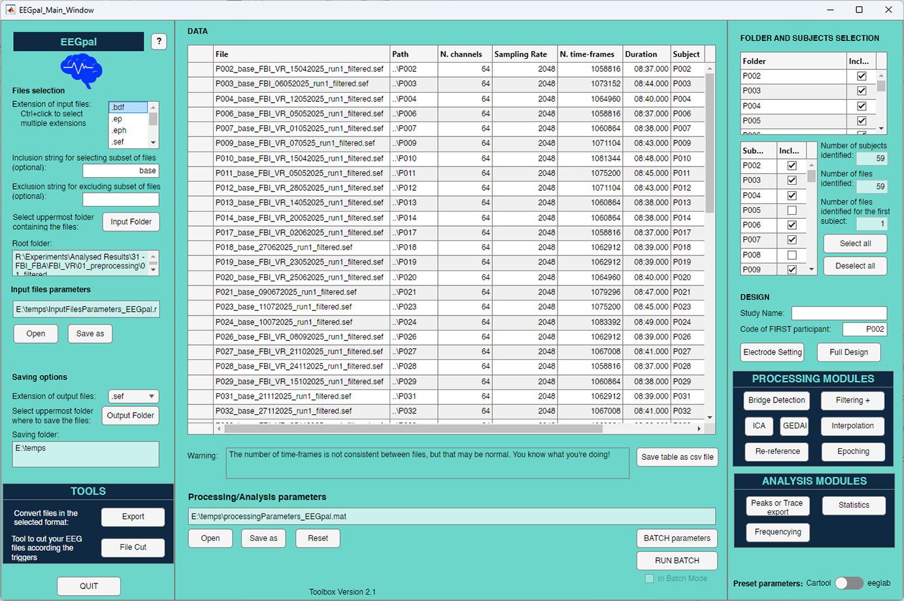

# EEGpal
EEGpal is open-source, Matlab-based software designed for the automated or semi-automated pre-processing and analysis of EEG data.
It proposes Graphical User Interfaces (GUIs) that allow EEG pre-processing to be batched across participants with a high degree of flexibility in processing parameters. 
It includes tools to :
- detect channel bridges
- filter data 
- performed independant component decomposition/recomposition ICA
- denoising with GEDAI toolbox
- interpolate 
- re-referencing
- epoching
- frequency analysis
- peaks or trace export
- statistics on tracks
- cut EEG files
- export to another format 

It suppotrs many different of file formats, such as: *.bdf, .set/.fdt, .eph,.ep, .sef, .ris, .freq, .mrk, .eeg/vhdr  
The purpose is to offer a complement to the free software Cartool developed by Denis Brunet (University of Geneva, reference:
Brunet D., Murray M., Michel C. (2011) Spatiotemporal analysis of multichannel EEG: CARTOOL. Computational intelligence and neuroscience, vol. 2011, 813870. DOI : 10.1155/2011/813870).  
It is also an alternative to the original EEGLAB GUI (reference: 
Delorme, A., & Makeig, S. (2004). EEGLAB: an open-source toolbox for analysis of single-trial EEG dynamics. Journal of Neuroscience Methods, 134(1), 9-21. DOI: 10.1016/j.jneumeth.2003.10.009). 

## How to use it
*Throughout the Guided User Interfaces (GUIs) you will find additional information while pressing on the* `❓ buttons`.
Otherwise you will find written tutorial files in the folder */Manuels* of this repository.
Tutorial videos are also available on YouTube at the following adress: https://www.youtube.com/channel/UCBh_zjgHfHARlKxwpFzlXWA

## Minimum requirement
Matlab 2018b or later
Tested on Windows and Mac. Should work on Linux but not tested.

## How to install and run
1. Download the EEGpal repository on your local drive.
2. If you already have an EEGLAB version mapped in your Matlab path, remove it, as it could cause a conflict with the EEGLAB version included in EEGpal.
3. Add this folder to your local Matlab path (use of the command *setpath('path of the EEGpal folder')*.
4. Use the command *EEGpal* to start the software.

## Cite the repository
De Pretto M., Mouthon M., EEGpal, (2024), GitHub repository, https://github.com/DePrettoM/EEGpal

## Dependencies
| PLUGINS | Description |
| ------ | ------ |
| [EEGLAB v2025.0](https://github.com/sccn/eeglab) | Included in the eeglab_plugins of this repository. Use in sveral places. Look at help to know more when it is used. |
| [Fieldtrip v20260207](https://www.fieldtriptoolbox.org/) | Partial version of Fieldtrip, including only the function to perform non-parametric and cluster analysis statistics. |
| [Signal processing toolbox](https://www.mathworks.com/products/signal.html) | Not included but Facultative. Use of the function filtfilt for filtering EEG data (alternative is to use EEGLAB function). | 
| [Statistics and Machine Learning Toolbox](https://www.mathworks.com/products/statistics.html) | Not included. It is mandatory to perform multi-factorial parametric analysis with the Statistics module. | 

| EEGLAB EXTENSIONS | Description | Already included in the eeglab_plugins repository
| ------ | ------ |
| [clean_rawdata v2.11]| Cleans raw EEG data. Contains ASR. |
| [Cleanline v2.1]| Removes sinusoidal artifacts (line noise). |
| [ICLabel v1.7]| Seven-category IC classifier using a neural network trained. |
| [firflit v2.8]| Routines for filtering data. |
| [GEDAI denoising plugin v1.7]| Generalized Eigenvalue De-Artifacting Instrument. |

| ISOLATED FUNCTIONS | Desciption |
| ------ | ------ |
| [eBridge.m v0.1.01] (https://psychophysiology.cpmc.columbia.edu/software/ebridge)| Identify channels within an EEG montage forming a low-impedance |
| [interpolate_perrinX] (https://github.com/mikexcohen/AnalyzingNeuralTimeSeries) |  interpolate electrodes using a 3D Spline method. Develop by Mike X Cohen |
| [fdr_bh.m] (https://www.mathworks.com/matlabcentral/fileexchange/27418-fdr_bh) |  Executes the Benjamini & Hochberg (1995) procedure for controlling the false discovery rate (FDR) of a family of hypothesis tests (version 2.3.0). Develop by David Groppe |

  
 The dependencies are already included in this repository (except for the Signal processing toolbox and Statistics and Machine Learning Toolbox which are comercial products of MathWorks).
 EEGpal can be used without the Matlab commercial Signal processing toolbox if you use the EEGLAB alternative for filtering.
 However, the Statistics module cannot be used without the Statistics and Machine Learning Toolbox.   
 
## Authors
[**Michael De Pretto**](https://orcid.org/0000-0003-4176-4798)\
*Scientific collaborator*\
*Michael.DePretto@unil.ch*\
*[Institut universitaire de formation et de recherche en soins](https://www.unil.ch/fbm/fr/home/menuinst/faculte/organisation/iufrs/contact.html)\
*University of Lausanne, Switzerland*

[**Michael Mouthon**](https://orcid.org/0000-0002-2557-4102)\
*Laboratory Engineer*\
*michael.mouthon@unifr.ch*\
*[FNDlab](https://www.unifr.ch/directory/fr/people/3229/6a825)\
*University of Fribourg, Switzerland*

## License

EEGpal is distributed under the BSD 2-Clause License.

 Third-party software included in this repository is distributed under its own respective licenses, which may differ from the EEGpal license. Users are responsible for complying with the license terms applicable to each third-party component (see <a href="LICENSE.txt">LICENSE.txt</a>).

## Disclamer
EEGpal is provided as an open-source toolbox to support EEG data analysis and scientific research. While every effort has been made to ensure the quality and reliability of the software, it is provided "as is", without warranty of any kind, express or implied.

